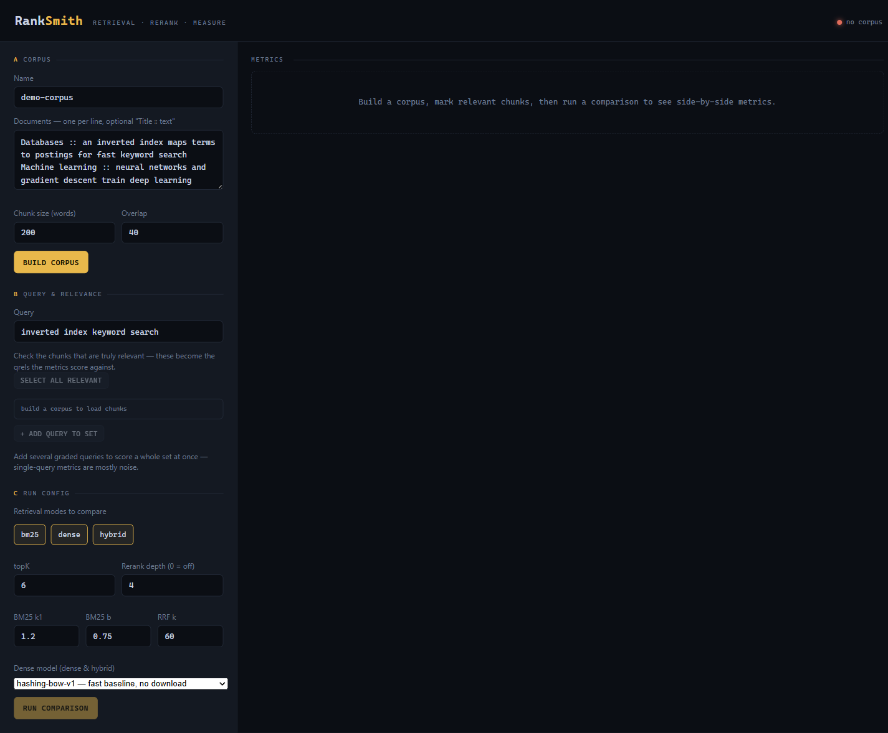
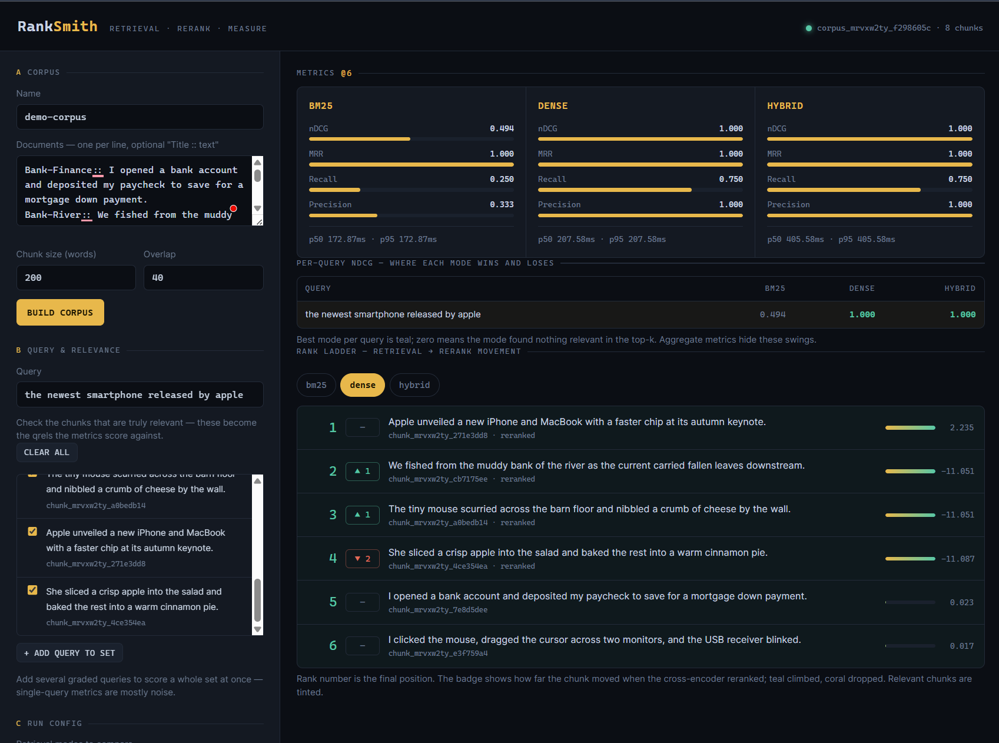

# RankSmith

RankSmith is a retrieval-reranking playground to compare **BM25**, **dense**, **hybrid**, and **cross-encoder reranking** on your own documents, with side-by-side metrics.

Import a corpus, run retrieval configs against a query set, and inspect per-query rankings and aggregate quality/latency metrics — all reproducibly.

## Screenshots

Configure a corpus, query set, and run config on the left; compare modes on the right. All offline — the shots below use the zero-download `hashing-bow-v1` baseline.

| Setup | Comparison |
| ----- | ---------- |
| [](docs/images/01-setup.png) | [](docs/images/02-results.png) |

The comparison view shows per-mode metrics (here BM25 nDCG `0.494` vs. dense/hybrid `1.000` on a vocabulary-mismatch query), a per-query nDCG table, and a rank ladder tracking how the cross-encoder moved each chunk.

## Features

- **Ingestion & chunking** — import documents, normalize text, chunk with metadata. Each corpus stores a content checksum over its documents so runs can pin exactly what they scored.
- **Retrieval baselines** — BM25 (sparse), dense embeddings (local `Xenova/all-MiniLM-L6-v2` via transformers.js, or a zero-dependency `hashing-bow-v1` baseline), and hybrid fusion (RRF / weighted).
- **Cross-encoder reranking** — rerank the top-K candidates with a real local cross-encoder (`Xenova/ms-marco-MiniLM-L-6-v2` via transformers.js) or a zero-dependency `lexical-overlap-v1` baseline, at configurable depth.
- **Evaluation** — Recall@k, Precision@k, MRR, nDCG, plus per-stage latency; per-query metrics and aggregates, compared side by side.
- **Reusable query sets** — save a set of graded queries once and re-run it against any config.
- **Trustworthy runs** — each run embeds, by value, its full config, corpus id + checksum, query set, and eval cutoff, plus the git commit it ran on and a **fingerprint** hashed over those inputs. Two runs share a fingerprint exactly when they differ only in the variable you're testing — so a metric delta is a real change, not config drift. See [Reproducibility](#reproducibility).
- **Playground UI** — served at the API root for setting up and comparing runs.

## Repository layout

Modular monolith organized as npm workspaces:

```text
apps/
  api/                  # HTTP API + orchestration; serves the playground UI at /
  web/                  # Playground UI (comparison + metrics views)
packages/
  core/                 # Shared domain models, config schemas
  ingestion/            # Parsers, normalization, chunking
  indexing/sparse/      # BM25 index build/search
  indexing/dense/       # Embeddings + vector index
  retrieval/            # BM25, dense, hybrid strategies
  reranking/            # Cross-encoder scoring and ordering
  evaluation/           # Metrics + run comparison
  storage/              # Repositories, filesystem artifacts
  observability/        # Logging, tracing, timing
data/                   # corpora / chunks / indexes / runs artifacts
configs/                # models / chunking / experiments presets
docs/                   # architecture / metrics
tests/                  # unit / integration / e2e
```

## Getting started

Requires Node.js (with npm workspaces support).

```bash
npm install
npm run build        # build all workspaces
npm run typecheck    # type-check all workspaces
npm test             # run workspace tests
```

### Run the API + playground

```bash
npm run build --workspace @ranksmith/api
npm start --workspace @ranksmith/api
```

Then open http://localhost:3000 for the playground UI.

- `PORT` — server port (default `3000`)
- `RANKSMITH_DATA` — artifact directory (default `data`, resolved relative to the process working directory)

> **Dense model download:** the first run using `dense.modelName: "Xenova/all-MiniLM-L6-v2"` downloads the model (~90MB) to the transformers.js cache; subsequent runs are offline. Use `hashing-bow-v1` for a zero-download baseline.
>
> **Reranker model download:** the first run with `rerankDepth > 0` and `crossEncoderModel: "Xenova/ms-marco-MiniLM-L-6-v2"` downloads the reranker (~90MB) to the transformers.js cache; subsequent runs are offline. Use `lexical-overlap-v1` for a zero-download baseline.

## API

| Method | Path | Description |
| ------ | ---- | ----------- |
| `GET`  | `/` | Playground UI |
| `GET`  | `/health` | Health check |
| `POST` | `/corpora` | Create a corpus (`name`, `documents`, optional `preset`) |
| `GET`  | `/corpora` | List corpora |
| `GET`  | `/corpora/:id` | Corpus details + chunk count |
| `GET`  | `/corpora/:id/chunks` | List corpus chunks |
| `POST` | `/query-sets` | Create a query set (`name`, `corpusId`, `queries`) |
| `GET`  | `/query-sets` | List query sets |
| `GET`  | `/query-sets/:id` | Query set details |
| `POST` | `/runs` | Create a run (`config`, `corpusId`, and either `querySetId` or inline `queries`; optional `evalK`) |
| `GET`  | `/runs` | List runs |
| `GET`  | `/runs/:id` | Run details + metrics |
| `GET`  | `/runs/:id/results` | Per-query results |

## Reproducibility

Every run is a self-describing artifact under `<data>/runs/`. Rather than referencing a config by id — which a later edit could silently re-point — each run **embeds by value** everything that determined its numbers:

- the resolved run config,
- the corpus id and its content checksum,
- the query set id and the eval cutoff (`evalK`),
- the git commit the server ran on (suffixed `-dirty` when the working tree had uncommitted changes), and
- a **fingerprint**: a SHA-256 over the inputs above, excluding ids, timestamps, and the commit hash.

The fingerprint is the comparison primitive. Two runs share a fingerprint **iff** they were scored on the same inputs, so:

- **same fingerprint, different metrics** → a real change (you varied the code — check the commit hashes),
- **different fingerprint** → you changed an input, so the metric delta is expected.

The commit hash is deliberately outside the fingerprint: identical inputs run on two commits keep the same fingerprint, surfacing "same experiment, different code" as exactly that.

## Status

Early development (`v0.1.0`). APIs and schemas may change.
